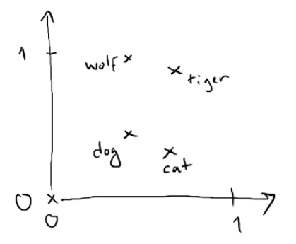
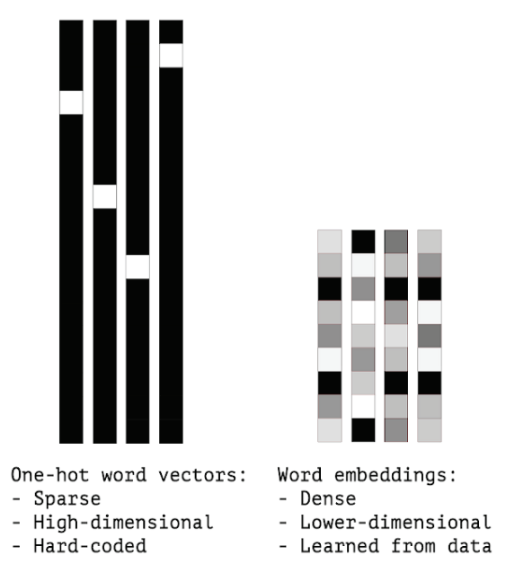

```{r, echo = F, warning=F, message=FALSE}
knitr::opts_chunk$set(cache = T, echo = F, warning = F,
                      kable.force.latex = TRUE)
```


```{r, echo = F, warning=F, message=FALSE}
library(tidyverse)
library(knitr)
#library(kableExtra)
#library(xts)
library(here)
library(gridExtra)

library(lmtest)
library(tseries)
library(urca)
library(fUnitRoots)
# library(quantmod)
```

```{r}
source(here("funs/testdf.R"))
```
 

```{r}
# First, let's define parameters of our experiment
nReps   <- 500
nObs    <- c(30, 50, 100, 200, 500, 1000, 2000, 10000)
alpha   <- c(0.99, 0.97, 0.95, 0.9, 0.8, 0.7, 0.6, 0.5, 0.4, 0.3, 0.2, 0.1, 0)
grid    <- expand.grid(nObs = nObs, alpha = alpha)
dfResults4grid    <- rep(NA, nrow(grid))
ppResults4grid   <- rep(NA, nrow(grid))
kpssResults4grid <- rep(NA, nrow(grid))
results <- rep(NA, nReps)
```

```{r}
# DF
for (k in 1:nrow(grid)) {
  nObs  <- grid[k, "nObs"]
  alpha <- grid[k, "alpha"]
  x  <- rep(0, nObs)
  for (j in 1:nReps) {
    for (i in 2:nObs) {
      x[i] <- alpha * x[i - 1] + rnorm(1, 0, 0.1)
    }
    df.test <- ur.df(x, type = "none", lags = 0)
    # 1 for correct decision, 0 for Type II error
    results[j] <- as.numeric(df.test@teststat[1] < df.test@cval[2])
  }
  # hence: mean() is the fraction of correct decisions 
  dfResults4grid[k] <- mean(results)
}
DF.results <- cbind(grid, power = dfResults4grid)
```

```{r}
# PP
for (k in 1:nrow(grid)) {
  nObs  <- grid[k, "nObs"]
  alpha <- grid[k, "alpha"]
  x  <- rep(0, nObs)
  for (j in 1:nReps) {
    for (i in 2:nObs) {
      x[i] <- alpha * x[i - 1] + rnorm(1, 0, 0.1)
    }
    pp.test <- ur.pp(x, type = c("Z-tau"), model = c("constant"))
    # 1 for correct decision, 0 for Type II error
    results[j] <- as.numeric(pp.test@teststat[1] < pp.test@cval[2])
  }
  # hence: mean() is the fraction of correct decisions 
  ppResults4grid[k] <- mean(results)
}
PP.results <- cbind(grid, power = ppResults4grid)
```

```{r}
# KPSS
for (k in 1:nrow(grid)) {
  nObs  <- grid[k, "nObs"]
  alpha <- grid[k, "alpha"]
  x  <- rep(0, nObs)
  for (j in 1:nReps) {
    for (i in 2:nObs) {
      x[i] <- alpha * x[i - 1] + rnorm(1, 0, 0.1)
    }
    kpss.test <- ur.kpss(x, type = c("mu"), use.lag = 0)
    # 1 for correct decision, 0 for Type I Error, 
    results[j] <- as.numeric(kpss.test@teststat[1] < kpss.test@cval[2])
  }
  # hence: mean() is the fraction of correcto decisions
  kpssResults4grid[k] <- mean(results)
}
# hence: 1-mean() is the fraction of correct decisions
KPSS.results <- cbind(grid, `1-TypeIError` = kpssResults4grid)
```

# INTRO 

The general goal of a topic model is to produce interpretable document representations which can be used to discover the topics or structure in a collection of unlabelled documents. An example of such an interpretable document representation is: document X is 20% topic a, 40% topic b and 40% topic c.

# Motivation

The main aim:

* to develop a methodology for analysing variability of **thematic motives** observed in courts' decisions over time:
    1. **classification** of courts judgements into a number of identified legal problem  (*topic modelling*)
    2. generating time series of relative frequencies of those above and then  modelling them with ARIMA (including identification and **forecasting**)

These two topics might be subject of being extended.

Contribution: 

* combining topic modelling with well-established TSA tools


# Main problem

**A very short sample** $\rightarrow$ only 48 observations for each time series!

- It affects a number of steps in the whole procedure:
    - low power of stationarity steps
    - inaccurate estimates of seasonal variables,  ARIMA parameters, ACF & PACF values
    - as a result: optimal orders of ARIMA are affected as well!
    - short out-of-sample period! $\rightarrow$ extremely hard to compare *ex-post* forecasting errors

- Is it possible to query longer samples?


# LDA

:::::: {.cols data-latex=""}

::: {.col data-latex="{0.55\textwidth}"}

Latent Dirichlet Allocation (LDA) is used to obtain thematical groups of judgements

- other alternatives?
    - word-embeddings? 
    - word2vec? 
    - **lda2vec**?
- any validations of such classification?

\vspace{5mm}
```{r out.width = "70%",fig.align="center"}
# All defaults


```
:::

::: {.col data-latex="{0.05\textwidth}"}
\ 
<!-- an empty Div (with a white space), serving as
a column separator -->
:::

::: {.col data-latex="{0.4\textwidth}"}
```{r out.width = "100%"}
# All defaults

```
:::
::::::


# Questions and issues which needs to ba addressed I

1. What is the motivation behind using LDA to assign cases to particular topics? Are there any other interesting alternatives? What about manual assigning? 
2. Unclear description of the way the LDA has been applied to classification process.
3. How exactly the perplexity metric was used?
4. Include naive forecasts as a benchmark!

# Questions and issues which needs to ba addressed II

5. Calculating averages of probabilities (of topics for a particular document) for a given time interval - lacking description of the process. A scheme perhaps?
6. Is anywhere in the analysis included the distance in time between:
    1. beginning of the case in court and final judgement? 
    1. time of all activities involved before the case is presented in the court?
7. Perhaps there are cases which are ready to be presented in court but have to wait until there are appropriate resources available?
8. Weekly frequency? Is it worth it?

# Questions and issues which needs to ba addressed III

9. What is the implication of finding cointegrated series. Why to search for them? Does it provide better forecasts or only useful for classification purposes?
10. Scales on vertical axes on time series plots - can those values be interpreted as probabilities? Do they sum up to 100% across all topics in a given month?
11. Optimal orders of ARIMA: how? Based on which criterion?
12. Why only KPSS results are presented? Why not to present ADF and PP as well?


# DF vs. PP vs KPSS

A simple simulation of AR(1):

$$
y_t = \alpha_1 y_{t-1} + \varepsilon_t
$$
where:

* $t = 1, \dots, T$
* $\alpha_1 \in \{0, 0.1, 0.2, 0.3., 0.4, 0.5, 0.6, 0.7, 0.8, 0.9, 0.95, 0.97, 0.99\}$
* 
$T \in \{ 39, 50, 100, 200, 500, 1000, 2000, 10000\}$
* $\varepsilon_t$ IID $\sim N(0, 0.1)$


# DF vs. PP

```{r, fig.height=8, fig.width=14}
p1 <-  
  DF.results %>%
  mutate(nObs  = factor(nObs, ordered = T),
         alpha = factor(alpha, ordered = T)) %>%
  ggplot(aes(nObs, alpha, z = power)) +
  geom_tile(aes(fill = power)) +
  theme_bw() +
  labs(title = "Power of DF test (fraction of correct decisions)", 
       subtitle = "AR(1) with 500 simulations for each combination") +
  scale_fill_distiller(palette = "Spectral")

p2 <-
  PP.results %>%
  mutate(nObs  = factor(nObs, ordered = T),
         alpha = factor(alpha, ordered = T)) %>%
  ggplot(aes(nObs, alpha, z = power)) +
  geom_tile(aes(fill = power)) +
  theme_bw() +
  labs(title = "Power of PP test, ie. fraction of correct decisions",  
       subtitle = "AR(1) with 500 simulations for each combination") +
  scale_fill_distiller(palette = "Spectral")

p3 <- 
  left_join(
    DF.results %>% rename(DF.power = power),
    PP.results %>% rename(PP.power = power),
    by = c("nObs", "alpha")
) %>%
  mutate(nObs  = factor(nObs, ordered = T),
         alpha = factor(alpha, ordered = T)) %>%
  mutate(diff = DF.power - PP.power) %>%
  ggplot(aes(nObs, alpha, z = diff)) +
  geom_tile(aes(fill = diff)) +
  theme_bw() +
  labs(title = "DF vs. PP: differences in power",
       subtitle = "AR(1) with 500 simulations for each combination") +
  scale_fill_distiller(palette = "Spectral")

grid.arrange(p1, p2, p3, ncol = 3)
```


# DF vs. KPSS

```{r, fig.height=8, fig.width=14}
p4 <-
  KPSS.results %>%
  mutate(nObs  = factor(nObs, ordered = T),
         alpha = factor(alpha, ordered = T)) %>%
  ggplot(aes(nObs, alpha, z = `1-TypeIError`)) +
  geom_tile(aes(fill = `1-TypeIError`)) +
  theme_bw() +
  labs(title = "(1 - Type I Error) for KPSS test", 
       subtitle = "AR(1) with 500 simulations for each combination") +
  scale_fill_distiller(palette = "Spectral")

p5 <- 
  left_join(
  DF.results %>% rename(DF.correct = power),
  KPSS.results %>% rename(KPSS.correct = `1-TypeIError`),
  by = c("nObs", "alpha")
) %>%
  mutate(nObs  = factor(nObs, ordered = T),
         alpha = factor(alpha, ordered = T)) %>%
  mutate(diff = DF.correct - KPSS.correct) %>%
  ggplot(aes(nObs, alpha, z = diff)) +
  geom_tile(aes(fill = diff)) +
  theme_bw() +
  labs(title = "DF vs. KPSS: diffs in fractions of correct decisions", 
       subtitle = "AR(1) with 500 simulations for each combination") +
  scale_fill_distiller(palette = "Spectral")

grid.arrange(p1, p4, p5, ncol = 3)
```


# Suggestions

- Why not to concentrate more on classification problem? More about LDA and alternatives, less about ARIMA and tests.

- Query more data if it is possible. With more data you can do:
    - multivariate cointegration with VECM
    - SARIMA models
    - VAR with possibly better forecasts
    - perhaps even LSTM for sequential data!
- Data can be possibly obtained with lower costs using SAOS API.

# SAOS: System Analizy Orzeczeń Sądowych

Documentation:

- https://www.saos.org.pl/help/index.php/dokumentacja-api/api-pobierania-danych

Query example:

```
https://www.saos.org.pl/api/dump/judgments?
        pageSize=100
        &pageNumber=1&
        &judgmentStartDate=2016-01-03
        &judgmentEndDate=2016-01-07
        &withGenerated=true
```


# Extensions

- longer time series
- other countries (comparison between them)
- seasonal ARIMA models
- multivariate cointegration and VECM
- forecasting with VAR
- forecasting with LSTM
